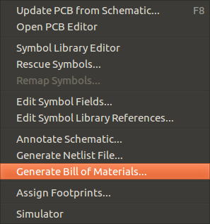
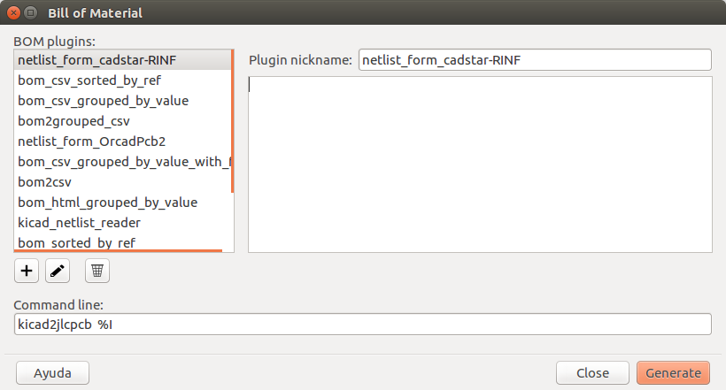

<!--
*** Template from https://github.com/othneildrew/Best-README-Template
*** markdown refecence https://www.markdownguide.org/basic-syntax/#reference-style-links
-->


[![Contributors][contributors-shield]][contributors-url]
[![Forks][forks-shield]][forks-url]
[![Stargazers][stars-shield]][stars-url]
[![Issues][issues-shield]][issues-url]
[![MIT License][license-shield]][license-url]


<br />
<p align="center">
  <h3 align="center">kicad2jlcpcb</h3>
  <p align="center">
    Plugin for KiCad 5 that allows generate files for jlcpcb pcb manufacturing and assembly service
    <br />
    <a href="https://github.com/danidask/kicad2jlcpcb"><strong>Explore the docs »</strong></a>
    <br />
    <br />
    <a href="https://github.com/danidask/kicad2jlcpcb/issues">Report Bug</a>
    ·
    <a href="https://github.com/danidask/kicad2jlcpcb/issues">Request Feature</a>
  </p>
</p>


<!-- TABLE OF CONTENTS -->
## Table of Contents

- [Table of Contents](#table-of-contents)
- [About The Project](#about-the-project)
- [How to install](#how-to-install)
  - [Prerequisites](#prerequisites)
  - [Installation or upgrade](#installation-or-upgrade)
- [How to use](#how-to-use)
  - [Convention](#convention)
  - [How to add custom fields](#how-to-add-custom-fields)
  - [How to generate the fabrication files](#how-to-generate-the-fabrication-files)
  - [Example output](#example-output)
- [Contributing](#contributing)
- [License](#license)
- [Acknowledgements](#acknowledgements)


<!-- ABOUT THE PROJECT -->
## About The Project

Plugin for KiCad 5 that allows generate files for jlcpcb pcb manufacturing and assembly service


## How to install

### Prerequisites

kicad2jlcpcb is a python module. In order to install it you'll need:
* python version 3.5 or above
* pip

TODO instructions of how to install these in each operating system

### Installation or upgrade

```sh
pip install git+https://github.com/danidask/kicad2jlcpcb --upgrade
```
<em>NOTE: If you have multiple versions of python in your machine, use a specific pip version, like pip3 or pip3.6</em>


## How to use

  This plugin will read custom fields in the parts, in order to know the part number, and if the fab house will place this component, or it'll be placed after. To acomplish this, follow the next convention:


### Convention

- Each component can have a custom field named "PartNumber" with the part number
- The components can have a custom field named "Keys" with one or several special words, separeted by commas:
  - DNP  (Do Not Place) This component will not be sent for assambley and will be included in a separated BOM file
  - EXCLUDE This component will not apear in any of the BOM files (ej mounting holes, logos...)


### How to add custom fields

To add this custom fields in kicad 5.1:
- Select the component (left click)
- Press "E" to open symbol properties
- Add Field (plus sign)


### How to generate the fabrication files

schema > tools > generate bill of materials


write this in "command line" field, and then click "generate"
```sh
kicad2jlcpcb %I
```

Kicad will generate a xml file with all the parts and pass it to the script as %I argument. The script will parse the xml file and generate the fabrication files with the necessary format.


### Example output

The files generated will have the format you can see in [examples](https://github.com/danidask/kicad2jlcpcb/tree/master/examples)


## Contributing

Contributions are what make the open source community such an amazing place to be learn, inspire, and create. Any contributions you make are **greatly appreciated**.

1. Fork the Project
2. Create your Feature Branch (`git checkout -b feature/AmazingFeature`)
3. Commit your Changes (`git commit -m 'Add some AmazingFeature'`)
4. Push to the Branch (`git push origin feature/AmazingFeature`)
5. Open a Pull Request


## License

Distributed under the MIT License. See `LICENSE` for more information.


## Acknowledgements

* [CPL rotation correction based of the work of Matthew Lai](https://github.com/matthewlai/JLCKicadTools)


<!-- MARKDOWN LINKS & IMAGES -->
<!-- https://www.markdownguide.org/basic-syntax/#reference-style-links -->
[contributors-shield]: https://img.shields.io/github/contributors/danidask/kicad2jlcpcb.svg?style=flat-square
[contributors-url]: https://github.com/danidask/kicad2jlcpcb/graphs/contributors
[forks-shield]: https://img.shields.io/github/forks/danidask/kicad2jlcpcb.svg?style=flat-square
[forks-url]: https://github.com/danidask/kicad2jlcpcb/network/members
[stars-shield]: https://img.shields.io/github/stars/danidask/kicad2jlcpcb.svg?style=flat-square
[stars-url]: https://github.com/danidask/kicad2jlcpcb/stargazers
[issues-shield]: https://img.shields.io/github/issues/danidask/kicad2jlcpcb.svg?style=flat-square
[issues-url]: https://github.com/danidask/kicad2jlcpcb/issues
[license-shield]: https://img.shields.io/github/license/danidask/kicad2jlcpcb.svg?style=flat-square
[license-url]: https://github.com/danidask/kicad2jlcpcb/blob/master/LICENSE.txt
